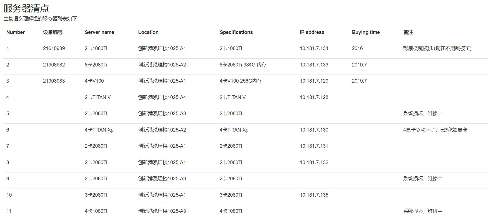

# 服务器管理

<aside>
⚠️ 具体操作请参考**服务器管理须知**，如有疑问请咨询师兄师姐

</aside>

[服务器管理须知](服务器管理_e64d16e3d4ab4582be35a6f6422c6756/服务器管理须知f8a92a38c97d4b9da973de3f57b9623a.md)

# 服务器清点

详细情况见 **腾讯文档**

后续服务器完善使用用户，对服务器进行整合和更新；

# 参考资料

[服务器常用操作](服务器管理_e64d16e3d4ab4582be35a6f6422c6756/服务器常用操作40e09958a1b047dabe6fbebc94ae190b.md)

[常用linux命令](服务器管理_e64d16e3d4ab4582be35a6f6422c6756/常用linux命令c1a8f89808a245c6a09ccfa81833f939.md)

[Git常用操作总结 - 知乎 (zhihu.com)](https://zhuanlan.zhihu.com/p/404642045)

[Git常用操作](服务器管理_e64d16e3d4ab4582be35a6f6422c6756/Git常用操作2ef823a6acf449b4997727bc8ddf67a3.md)

# 其他事项

[服务器IP申请](服务器管理_e64d16e3d4ab4582be35a6f6422c6756/服务器IP申请81f3ec7947d441b4b8b840c0c89b865e.md)